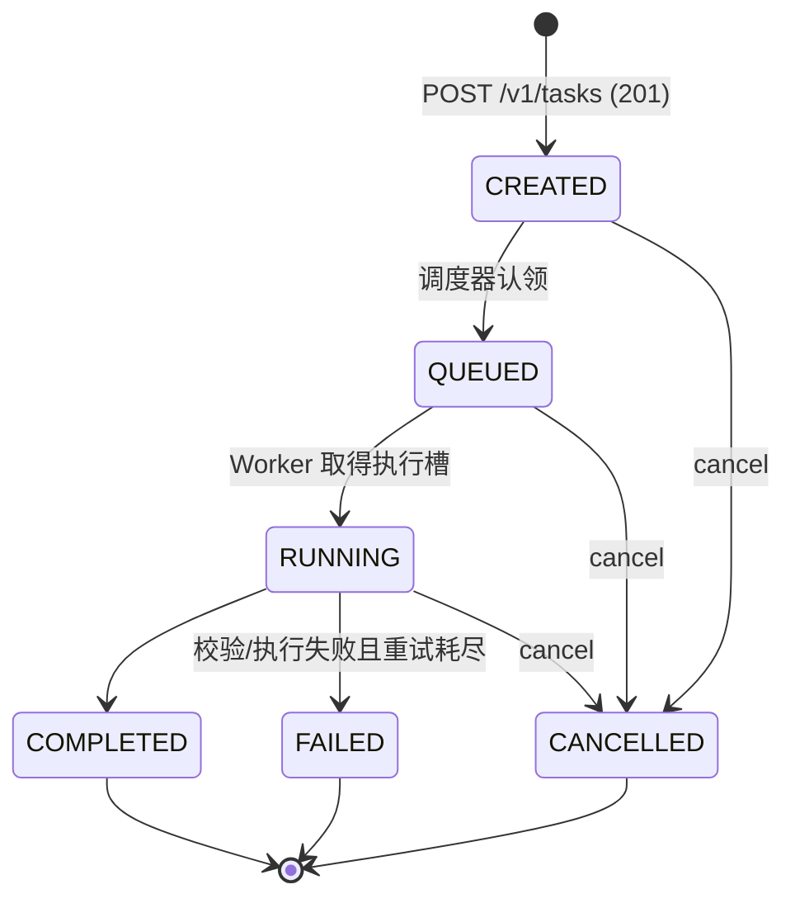

# MatriQ Cloud SDK 接口文档

> - 版本:SDK 目标接入方案 v1(2026-09-17)
> - 读者:Python SDK 开发者、第三方集成方
> - 权威声明:HTTP 方法、路径、请求/响应类型的唯一权威是 FastAPI 的 `/openapi.json`(交互浏览见 `/docs`)。本文是 SDK 集成视角的导读与约定,两者冲突时以 `/openapi.json` 为准。
> - 业务规则的规范位置:OpenSpec(`openspec/specs/*`),本文同步已实现行为和已确认的目标接入约定。
> - 实现状态:API Key 管理和正式 Python SDK 尚未实现；本文明确目标接入方式，当前 Web 控制台 JWT 不属于 SDK 接入契约。

---

## 1. 概述

Web 控制台与 Python SDK **共用同一 `/v1` API**。SDK 规划的公开能力面如下，其中 API Key 管理和正式 SDK 仍待实现:

| 能力 | 说明 |
| --- | --- |
| 认证 | 用户只提供平台生成的 `api_key`，SDK 自动完成所有 API 调用认证 |
| 执行目标查询 | 模拟器/QPU 目录、状态、可提交性、队列深度 |
| 提交前校验 | 不创建任务,提前发现配置/程序/目标问题 |
| 任务提交 | 幂等创建,支持 digital/analog 两类程序 |
| 任务查询 | 列表(分页/筛选)、详情(状态/阶段/进度/等待原因) |
| 任务操作 | 取消 |
| 任务产物 | 日志、最终结果、结果下载 |

### 1.1 Web 与 SDK 共用同一套业务 API

SDK 不调用另一套后端，也不存在 `/sdk/*` 镜像业务路由。Web 与 SDK 都调用同一组已注册 `/v1` 路径、Pydantic DTO 和 application use case；区别只在进入业务路由前使用的凭据：

```text
Web -- Bearer JWT -----\
                        +--> credential resolver --> Principal --> same /v1 route --> same use case
SDK -- Bearer API Key -/
```

因此，通过 SDK 创建的任务可以在 Web 控制台中查看，Web 创建的任务也可以由同一用户通过 SDK 查询；两种入口共享权限、所有权、租户隔离、幂等、状态和错误语义。`/v1/auth/*`、API Key 管理、管理员及 Worker/Agent 内部端点属于控制台或内部接口，不进入 SDK 公开面。

`openapi-sdk.yaml` 是权威 FastAPI `/openapi.json` 的目标筛选发布视图，只排除上述非 SDK 端点，不代表第二套 API 或第二份字段事实来源。

### 1.2 Base URL

| 环境 | 地址 |
| --- | --- |
| 本地开发 | `http://localhost:8000` |
| 生产 | 具体域名待网关确定；发布时固化在正式 SDK 内，普通用户无需传入 `base_url` |

所有接口都在 `/v1` 前缀下,请求/响应体均为 `application/json`。

本地开发和原始 HTTP 调试仍可显式使用地址；正式 SDK 的普通用户入口只要求平台生成的 `api_key`。

### 1.3 路径命名和版本边界

SDK 直接使用平台公共 API 的资源路径，不定义客户端专属 URL。`/v1` 是整套公共 HTTP 契约的主兼容版本，因此以后增加用户、计费或设备管理能力时，向后兼容的新接口仍位于同一个 `/v1` 下，而不是为每个模块分别建立版本：

- 用户和凭据使用一级资源名，例如 `/v1/users`、规划中的 `/v1/api-keys`；
- 计费领域使用 `/v1/billing/*` 分组，例如现有 `/v1/billing/invoices`、`/v1/billing/usage` 和 `/v1/billing/quotas`；
- 设备使用 `/v1/devices` 资源及真实从属关系，例如 `/v1/devices/{device_id}/availability`；
- 不增加 `/sdk/v1/*`、`/v1/user-module/*` 或 `/v1/getUserList` 等客户端、代码模块或方法名路径。

新增业务能力本身不触发 `/v2`；只有无法向后兼容现有调用方的公共合同变化才评估新的主版本。完整命名规则见 [API 契约：路径和版本命名](API_CONTRACT.md#路径和版本命名)。这些示例只说明命名约定，SDK 当前实际公开的 operation 仍以权威 OpenAPI 的筛选视图和本文第 6、14 节为准。

---

## 2. 通用约定

### 2.1 成功响应 Envelope

所有成功响应使用统一 Envelope 格式:

```json
{
  "code": 0,
  "message": "success",
  "data": { },
  "timestamp": 1760000000000
}
```

| 字段 | 类型 | 说明 |
| --- | --- | --- |
| `code` | int | 业务码,成功恒为 `0` |
| `message` | string | 人类可读消息,如 `"Task created successfully"` |
| `data` | object | 业务载荷,接口各异 |
| `timestamp` | int | 服务器 Unix 时间戳(毫秒) |

例外:`GET /v1/tasks/{task_id}/download` 返回**不带 Envelope** 的原始 JSON 附件(见 §6.11)。

### 2.2 错误响应

错误**不使用 Envelope**,沿用 FastAPI 标准结构:

```json
{ "detail": "任务尚未完成" }
```

请求体校验失败(422)时 `detail` 为数组,`loc` 定位到具体字段:

```json
{
  "detail": [
    {
      "type": "greater_than_equal",
      "loc": ["body", "parameters", "shots"],
      "msg": "Input should be >= 100",
      "input": 10
    }
  ]
}
```

### 2.3 分页

列表接口统一使用 `page` / `page_size` 查询参数,响应内 `pagination` 结构:

```json
{ "page": 1, "page_size": 20, "total": 57, "total_pages": 3 }
```

`page >= 1`,`1 <= page_size <= 100`。

### 2.4 时间与 ID

- 时间字段为 ISO 8601 UTC 字符串,如 `"2026-09-16T08:00:00+00:00"`(日志条目用 `"…Z"` 后缀,同为 UTC)。
- 任务 ID 形如 `task-<16位hex>`;目标 ID 为规范 slug,如 `sim-na-01`。
- 兼容别名:提交时 `device_id="simulator"` 会被服务端解析到 `sim-na-01`。SDK 应始终发送规范 ID,响应中也只出现规范 ID。

---

## 3. SDK 鉴权:只使用 `api_key`

### 3.1 唯一接入参数

用户在平台 API Key 页面生成自己的 Key。使用正式 SDK 时只需传入这一个参数:

```python
from matriq import MatriqClient

client = MatriqClient(api_key="your_api_key")
```

SDK 内置官方 API 地址，并自动用该 `api_key` 认证所有后续 API 请求。用户不需要提供 `base_url`、邮箱、密码、access token、refresh token 或手写认证 Header。

### 3.2 API Key 生命周期

- 每个用户只有一个当前 API Key，默认不自动过期；
- 用户可以在平台页面随时查看和复制同一个完整 Key；
- 点击“更新”后生成新 Key，旧 Key 立即失效；
- 用户撤销 Key、账号被禁用或权限被收缩后，现有 Key 立即失效；
- API Key 管理、完整值和服务端存储细节不进入普通 SDK API 调用。

### 3.3 SDK 错误处理

- Key 缺失、错误、已更新或已撤销时抛出 `AuthenticationError`；
- Key 对目标操作没有权限时抛出 `PermissionDeniedError`；
- SDK 不执行登录或 token 刷新，也不会在 401 后调用 Web 登录接口；
- 日志、异常、`repr()` 和 notebook 输出不得包含完整 API Key。

---

## 4. 核心数据模型

### 4.1 Task Schema

所有任务接口的 `data`(或列表项)使用同一 Task schema:

| 字段 | 类型 | 说明 |
| --- | --- | --- |
| `id` | string | 任务 ID,全局唯一 |
| `name` | string | 任务名 |
| `description` | string \| null | 描述 |
| `type` | string | `quantum_task` / `program_set` / `hybrid_job` |
| `status` | string | 主状态,见 §4.2 |
| `device_id` / `target_id` | string | 规范执行目标 ID(两者一致) |
| `device_name` | string | 目标展示名 |
| `shots` | int | 请求的采样次数 |
| `progress` | int | 检查点进度,0–100 |
| `phase` | string | 执行阶段,见 §4.2 |
| `phase_started_at` | string \| null | 当前阶段开始时间 |
| `elapsed_seconds` | float | 服务端计算已耗时(未开始为 0,完成后固定) |
| `attempt` | int | 当前尝试序号,从 0 开始,重试时递增 |
| `waiting_reason` | string \| null | 排队原因,见 §4.2;仅非运行态有值 |
| `created_at` / `updated_at` / `started_at` / `completed_at` | string \| null | 生命周期时间戳 |
| `created_by` / `created_by_name` | string | 创建者 |
| `estimated_cost` / `actual_cost` | float | 费用(当前恒为 0) |
| `program` | object | `{type, content, size}`,size 为内容字节数 |
| `parameters` | object | 提交参数(含合并后的 `tags`) |
| `resource_usage` | object | 资源用量(当前为空对象) |
| `error` | string \| null | 失败原因;终态 FAILED 时有值 |

### 4.2 枚举

**任务主状态 `status`**

| 值 | 含义 | 是否终态 |
| --- | --- | --- |
| `CREATED` | 已保存,等待调度扫描 | 否 |
| `QUEUED` | 已入目标队列,等待执行槽 | 否 |
| `RUNNING` | Worker 正在执行 | 否 |
| `COMPLETED` | 执行成功,结果可读 | 是 |
| `FAILED` | 执行失败(重试耗尽) | 是 |
| `CANCELLED` | 用户取消 | 是 |

**执行阶段 `phase`**(按序推进,`progress` 为检查点制,长时间停在某个百分比属正常):

```
QUEUED → VALIDATING → PREPARING → COMPILING → SIMULATING → SAMPLING → SERIALIZING → COMPLETED
```

**等待原因 `waiting_reason`**

| 值 | 出现条件 |
| --- | --- |
| `WAITING_FOR_DISPATCH` | status=CREATED,尚未被调度器认领 |
| `TARGET_QUEUE` | status=QUEUED,目标空闲但仍有排队 |
| `TARGET_BUSY` | status=QUEUED,目标执行槽被占用 |
| `TARGET_OFFLINE` | status=QUEUED,目标离线 |
| `TARGET_DRAINING` | status=QUEUED,目标维护排空中 |
| `TARGET_UNAVAILABLE` | status=QUEUED,目标不可用 |

**设备状态 `status`(Target/Device)**

| 值 | 含义 | 可提交 |
| --- | --- | --- |
| `STARTING` | Worker 启动中 | 否 |
| `IDLE` | 空闲 | ✅ |
| `BUSY` | 执行中(**仍可提交,任务排队**) | ✅ |
| `UNAVAILABLE` | Worker 异常 | 否 |
| `DRAINING` | 维护排空中 | 否 |
| `OFFLINE` | 无存活 Worker | 否 |
| `PLANNED` | 规划中(如 `qpu-na-01`) | 否 |

### 4.3 Device Schema

```json
{
  "id": "sim-na-01",
  "name": "Neutral Atom Simulator 01",
  "type": "simulator",
  "status": "IDLE",
  "available": true,
  "submittable": true,
  "capability_version": "neutral-atom-target.v1",
  "capabilities": {
    "modes": ["digital", "analog"],
    "program_formats": ["openqasm3", "json"],
    "required_worker_capabilities": ["legacy-gate-circuit.v1", "neutral-atom-analog.v1"],
    "max_qubits": 16,
    "max_shots": 10000
  },
  "queue": { "running": 1, "waiting": 2, "healthy_workers": 1 }
}
```

`available` 与 `submittable` 当前同值:目标生命周期 ACTIVE 且聚合状态为 `IDLE`/`BUSY`。提交前应读取 `capabilities` 做客户端预检(modes / program_formats / max_qubits / max_shots),以 `queue.waiting` 估算排队时长(每目标并发 1)。

---

## 5. 接口总览

| # | 方法 | 路径 | 用途 | 鉴权 |
| --- | --- | --- | --- | --- |
| 6.1 | GET | `/v1/devices` | 目标列表(筛选) | API Key |
| 6.2 | GET | `/v1/devices/{device_id}` | 单目标详情 | API Key |
| 6.3 | GET | `/v1/devices/{device_id}/availability` | 目标可提交性 | API Key |
| 6.4 | POST | `/v1/tasks/validate` | 提交前校验(不创建) | API Key |
| 6.5 | POST | `/v1/tasks` | **任务提交(幂等)** | API Key |
| 6.6 | GET | `/v1/tasks` | 任务列表查询 | API Key |
| 6.7 | GET | `/v1/tasks/{task_id}` | **任务状态查询** | API Key |
| 6.8 | POST | `/v1/tasks/{task_id}/cancel` | 取消任务 | API Key |
| 6.9 | GET | `/v1/tasks/{task_id}/logs` | 执行日志 | API Key |
| 6.10 | GET | `/v1/tasks/{task_id}/results` | 最终结果 | API Key |
| 6.11 | GET | `/v1/tasks/{task_id}/download` | 结果下载(JSON 附件) | API Key |

---

## 6. 接口详解

### 6.1 目标列表 — `GET /v1/devices`

**查询参数**

| 参数 | 类型 | 说明 |
| --- | --- | --- |
| `type` | string | 过滤类型:`simulator` / `qpu` |
| `status` | string | 过滤状态,取值见 §4.2 设备状态 |
| `available` | bool | 过滤可提交性 |

**响应 200**:`data = { "items": [TargetView, ...] }`,按目标 ID 排序,含规划中的 QPU(如 `qpu-na-01`,仅展示 `PLANNED`/`submittable=false`)。

**典型错误**:401 未认证。

---

### 6.2 目标详情 — `GET /v1/devices/{device_id}`

**响应 200**:`data` 为单个 Device 对象(§4.3)。

**错误**:404 `Device not found`;401。

---

### 6.3 目标可提交性 — `GET /v1/devices/{device_id}/availability`

**查询参数**:`start_date` / `end_date`(可选,当前未生效)。

**响应 200**

```json
{
  "device_id": "sim-na-01",
  "status": "IDLE",
  "available": true,
  "submittable": true,
  "availability": []
}
```

`availability` 预留时段数组,当前恒为空;提交判断只看 `submittable`。

**错误**:404 `Device not found`。

---

### 6.4 提交前校验 — `POST /v1/tasks/validate`

与任务提交(§6.5)使用**完全相同的请求体**,但不创建任务、不消耗配额。SDK 应在提交前调用,用于表单期反馈。

**响应 200**(`data`)

```json
{
  "valid": true,
  "program_count": 1,
  "estimated_cost": 0,
  "backend": "Neutral Atom Simulator 01",
  "target_id": "sim-na-01"
}
```

| 字段 | 说明 |
| --- | --- |
| `program_count` | 数字任务为电路数;hybrid_job 为迭代数;其余为 1 |
| `estimated_cost` | 当前恒为 0 |

**错误**(均为 `{"detail": "..."}`,可读消息):

| 状态码 | 场景 | 示例 |
| --- | --- | --- |
| 404/422 | 未知目标 | `Unknown execution target: sim-na-99` |
| 409 | 目标不可提交(离线/维护/规划中) | `Execution target sim-na-01 is OFFLINE and cannot accept tasks` |
| 422 | 模式/格式/shots 与目标能力不匹配 | `Target sim-na-01 does not support mode analog` |
| 422 | 程序不合法 | `不支持的 OpenQASM 语句:...` |

---

### 6.5 任务提交 — `POST /v1/tasks`

**请求头**

| Header | 必填 | 说明 |
| --- | --- | --- |
| `Authorization: Bearer <api_key>` | 是 | SDK 内部自动携带，普通用户无需手写 |
| `Idempotency-Key` | 否 | 1–100 字符;强烈建议 SDK 总是携带,见 §9 |
| `Content-Type: application/json` | 是 | |

**请求体**

| 字段 | 类型 | 约束 |
| --- | --- | --- |
| `name` | string | 1–120 字符,须含非空白字符 |
| `description` | string \| null | ≤ 2000 字符 |
| `type` | string | `quantum_task` / `program_set` / `hybrid_job` |
| `device_id` | string | 1–64 字符,`^[a-z0-9-]+$`;规范值 `sim-na-01..03` |
| `program` | object | `{ "type": "openqasm3" \| "json", "content": "<1–100000 字符字符串>" }` |
| `parameters` | object | 见下表;**未知字段会被拒绝(422)** |
| `tags` | string[] | ≤ 20 项 |

`parameters` 字段:

| 字段 | 类型 | 约束 | 默认 |
| --- | --- | --- | --- |
| `shots` | int | 100–10000,且 ≤ 目标 `max_shots` | 1000 |
| `mode` | string | `digital` / `analog`(须在目标 `modes` 内) | `digital` |
| `max_parallel` | int | 1–8 | 1 |
| `timeout` | int | 5–10800(秒) | 1800 |
| `retry_policy` | string | `none` / `retry_once` / `retry_twice` / `retry_three` | `retry_once` |

> 注意:`program.content` 永远是**字符串**——JSON 程序必须先序列化为字符串再放入。顶层未知字段会被静默忽略(拼写错误不会报错),SDK 应在客户端做严格字段校验。

**digital 提交示例**

```json
{
  "name": "bell-state-demo",
  "description": "SDK example",
  "type": "quantum_task",
  "device_id": "sim-na-01",
  "program": {
    "type": "openqasm3",
    "content": "OPENQASM 3.0;\ninclude \"stdgates.inc\";\nqubit[2] q;\nbit[2] c;\nh q[0];\ncx q[0], q[1];\nc = measure q;"
  },
  "parameters": { "mode": "digital", "shots": 1000 },
  "tags": ["sdk-demo"]
}
```

**analog 提交示例**(canonical neutral-atom IR v1,完整约束见 §7)

```json
{
  "name": "adiabatic-2atom",
  "type": "quantum_task",
  "device_id": "sim-na-01",
  "program": {
    "type": "json",
    "content": "{\"ir_version\":\"1.0\",\"kind\":\"neutral_atom.analog.adiabatic\",\"geometry\":{\"unit\":\"um\",\"positions\":[[0.0,0.0],[8.0,0.0]]},\"protocol\":{\"time_unit\":\"us\",\"angular_frequency_unit\":\"rad/us\",\"total_time_us\":2.0,\"n_steps\":100,\"omega_max_rad_per_us\":10.0,\"delta_global_initial_rad_per_us\":-10.0,\"delta_local_max_rad_per_us\":10.0},\"detuning_weights\":{\"0\":1.0,\"1\":0.5},\"backend\":\"qutip\"}"
  },
  "parameters": { "mode": "analog", "shots": 1000 }
}
```

**响应 201**(首次创建;幂等重放为 200,内容相同)

`data` 为完整 Task schema(§4.1),创建瞬间典型值:

```json
{
  "code": 0,
  "message": "Task created successfully",
  "data": {
    "id": "task-1a2b3c4d5e6f7a8b",
    "name": "bell-state-demo",
    "status": "CREATED",
    "target_id": "sim-na-01",
    "device_id": "sim-na-01",
    "device_name": "Neutral Atom Simulator 01",
    "shots": 1000,
    "progress": 0,
    "phase": "QUEUED",
    "phase_started_at": "2026-09-16T08:00:00+00:00",
    "elapsed_seconds": 0.0,
    "attempt": 0,
    "waiting_reason": "WAITING_FOR_DISPATCH",
    "error": null,
    "...": "其余字段见 §4.1"
  },
  "timestamp": 1760000000000
}
```

**错误**

| 状态码 | 场景 |
| --- | --- |
| 422 | 请求体校验失败 / 未知目标 / 能力不匹配 / 程序不合法(同 §6.4) |
| 409 | 目标不可提交(离线、维护、自检失败、规划中) |
| 409 | `同一提交标识不能用于不同配置`(幂等键冲突,见 §9) |
| 401 | 未认证 |

---

### 6.6 任务列表查询 — `GET /v1/tasks`

仅返回**当前用户自己的任务**(所有权隔离)。

**查询参数**

| 参数 | 类型 | 说明 |
| --- | --- | --- |
| `page` | int | ≥ 1,默认 1 |
| `page_size` | int | 1–100,默认 20 |
| `status` | string | 精确匹配,如 `RUNNING`(大写) |
| `type` | string | 如 `quantum_task` |
| `device_id` | string | 如 `sim-na-01` |
| `search` | string | 模糊匹配任务名或任务 ID |

**响应 200**(`data` 字段)

```json
{
  "items": [ /* Task schema array */ ],
  "pagination": { "page": 1, "page_size": 20, "total": 42, "total_pages": 3 },
  "summary": { "queued": 2, "running": 1, "completed": 38, "failed": 1, "cancelled": 0, "total": 42 }
}
```

`summary` 为当前用户全部任务的状态计数(不受筛选影响)。

---

### 6.7 任务状态查询 — `GET /v1/tasks/{task_id}`

SDK 轮询的主接口。**响应 200**:`data` 为完整 Task schema,重点字段:`status`、`phase`、`progress`、`elapsed_seconds`、`attempt`、`waiting_reason`、`error`。

排队中的任务会根据目标实时状态解释等待原因,例如目标正忙时返回 `"waiting_reason": "TARGET_BUSY"`、`"progress": 0`。

**错误**:404 `Task not found`(不存在**或不属于当前用户**,所有权隔离不区分两者);401。

---

### 6.8 取消任务 — `POST /v1/tasks/{task_id}` `/cancel`

对任何非终态任务(CREATED/QUEUED/RUNNING)可取消。

**响应 200**

```json
{ "code": 0, "message": "Task cancelled successfully", "data": { "id": "task-...", "status": "CANCELLED" }, "timestamp": 1760000000000 }
```

**错误**:409 `Task is already terminal`(COMPLETED/FAILED/CANCELLED);404。

---

### 6.9 任务日志 — `GET /v1/tasks/{task_id}/logs`

**响应 200**(`data`)

```json
{
  "logs": [
    {
      "timestamp": "2026-09-16T08:00:00Z",
      "level": "INFO",
      "message": "CREATED:任务配置已保存,等待调度",
      "source": "execution-runtime"
    }
  ],
  "has_more": false,
  "next_token": null
}
```

`level` 取值 `INFO` / `WARN` / `ERROR`。当前返回全量已存数组,`has_more` 恒为 `false`,不支持时间/级别过滤与游标分页(路线图见 §13)。

---

### 6.10 任务结果 — `GET /v1/tasks/{task_id}/results`

仅 **COMPLETED** 任务可读;运行中不返回部分结果(无 occupation 曲线/中间 samples 流式)。

**响应 200**(`data`)

```json
{ "status": "completed", "output": { }, "files": [] }
```

`output` 按模式不同(完整示例见 §7.3);`files` 当前恒为空数组。

**Digital 输出 schema**

```json
{
  "schema_version": "1.0",
  "kind": "digital",
  "measurements": { "00": 512, "11": 488 },
  "programs": [ { "index": 0, "counts": { "00": 512, "11": 488 }, "shots": 1000 } ],
  "shots": 1000,
  "bit_order": "most-significant-qubit-first",
  "simulated": true,
  "backend": {
    "name": "legacy-gate-simulator",
    "adapter": "legacy-gate-circuit.v1",
    "simulator_package": "matriq-cloud",
    "simulator_version": "0.1.0",
    "capability_version": "neutral-atom-target.v1"
  },
  "input": { "sha256": "…" }
}
```

**Analog 输出 schema**

```json
{
  "schema_version": "1.0",
  "kind": "analog",
  "simulated": true,
  "backend": {
    "name": "…",
    "adapter": "neutral-atom-analog.v1",
    "simulator_package": "neutral-atom-vqpu",
    "simulator_version": "…",
    "capability_version": "neutral-atom-target.v1"
  },
  "input": { "ir_version": "1.0", "sha256": "…" },
  "observables": {
    "occupations": { "values": [[0.0], [0.5], [1.0]], "dtype": "float64", "shape": [3, 1], "unit": "probability" },
    "times": { "values": [0.0, 1.0, 2.0], "dtype": "float64", "shape": [3], "unit": "us" },
    "final_occupation": [1.0]
  },
  "shots": null,
  "sampling": {
    "performed": false,
    "requested_shots": 1000,
    "reason": "canonical analog v1 currently returns deterministic occupation data"
  }
}
```

> analog v1 返回**确定性演化**结果(occupation trajectory + 时间轴 + final occupation),不执行随机采样——`shots` 仅为兼容请求字段,`sampling.performed=false` 明确标记。

**错误**:409 `任务尚未完成`;404 `该历史记录没有可用结果`(历史数据迁移任务);404 任务不存在。

---

### 6.11 结果下载 — `GET /v1/tasks/{task_id}/download`

**响应 200**:不带 Envelope 的原始 JSON,带附件头:

```
Content-Disposition: attachment; filename="task-<id>.json"
```

```json
{ "task": { "Task schema...": "..." }, "output": { "结果 DTO,同 §6.10": "..." } }
```

**错误**:409 `结果尚不可用`(未完成或无结果)。

---

## 7. 程序格式与任务类型矩阵

| type \ mode | `digital` | `analog` |
| --- | --- | --- |
| `quantum_task` | `openqasm3` 或 `json`(单电路) | `json`(canonical neutral-atom IR v1) |
| `program_set` | `json`(`programs` 数组,1–100 个电路) | 不支持(422) |
| `hybrid_job` | `json`(`iterations`/`initial_angle`) | 不支持(422) |

平台**只接受声明式输入**。Python DSL 必须在 SDK 客户端本地转换为 canonical IR 后提交;服务端拒绝并永不执行 Python 源码、pickle 或字节码。

### 7.1 digital 电路

**openqasm3(受限子集)**——单寄存器 `q`,1–16 qubits,门序列 ≤ 2000:

- 单比特门:`h` `x` `y` `z`(无参)、`rx` `ry` `rz`(必须带角度参数)
- 双比特门:`cx` `cz` `swap`(必须同时给 `q[i], q[j]`)
- 角度表达式:数字、`pi`、四则运算
- 测量:`c = measure q;` 或 `measure q -> c;`(必须在门之后)

**json(单电路)**

```json
{ "qubits": 2, "gates": [ { "name": "h", "target": 0 }, { "name": "cx", "control": 0, "target": 1 } ] }
```

规则:门名小写;双比特门必须给整数 `control`;`params` 为有限数字数组。

### 7.2 program_set / hybrid_job

**program_set**:`{"programs": [circuit, ...]}`,1–100 个电路,每个电路结构同上。

**hybrid_job**:`{"iterations": 10, "initial_angle": 1.0}`,iterations 1–100;内部对单 qubit `ry` 迭代演化,输出含每次迭代的 `expectation_z` 与 counts。

### 7.3 analog(canonical neutral-atom IR v1)

`program.type` 必须为 `json`,`content` 为符合以下 schema 的 JSON 字符串(所有字段未知即拒绝):

| 字段 | 约束 |
| --- | --- |
| `ir_version` | 恒为 `"1.0"`(未知主版本拒绝) |
| `kind` | 恒为 `"neutral_atom.analog.adiabatic"` |
| `geometry.unit` | `"um"`;`positions` 1–16 个**唯一**的有限二维坐标 |
| `protocol.time_unit` / `angular_frequency_unit` | `"us"` / `"rad/us"` |
| `protocol.total_time_us` | (0, 1000] |
| `protocol.n_steps` | 4–2000 |
| `protocol.omega_max_rad_per_us` | [0, 1000] |
| `protocol.delta_global_initial_rad_per_us` / `delta_local_max_rad_per_us` | [-1000, 1000] |
| `detuning_weights` | 键为原子下标字符串(如 `"0"`),值为有限数 |
| `backend` | `"qutip"` |

---

## 8. 任务生命周期与轮询

### 8.1 状态机



`parameters.retry_policy` 决定失败后的重试次数(上限三次),每次重试 `attempt` +1;`timeout` 限制单次执行时长。

### 8.2 轮询策略(SDK 必读)

- **当前版本没有任务事件推送**。`/v1/ws` 的订阅确认不代表任务广播,SDK 不得依赖 WebSocket 获取任务状态。
- 轮询 `GET /v1/tasks/{task_id}`,建议起步 2–5 秒,长任务退避到 10–30 秒;终态(`COMPLETED`/`FAILED`/`CANCELLED`)即停止。
- `progress` 是**检查点制**:`SIMULATING` 阶段长时间停留在 40% 而仅 `elapsed_seconds` 增长属正常,SDK 不要按墙钟自造百分比。
- 结果在任务 COMPLETED **之后**才可读(409 语义),不存在部分结果。

---

## 9. 幂等与重试(提交接口)

`POST /v1/tasks` 的幂等行为(规范:OpenSpec `task-submission`):

| 场景 | 结果 |
| --- | --- |
| 首次携带某 `Idempotency-Key` | **201**,创建新任务 |
| 相同用户 + 相同 Key + **完全相同**的请求配置 | **200**,返回原任务(不重复创建) |
| 相同用户 + 相同 Key + **任何字段不同**(含任务名、参数、程序) | **409** `同一提交标识不能用于不同配置` |
| 不带 Key | 每次都创建新任务(201) |
| 不同用户使用相同 Key | 各自独立,互不可见 |

"完全相同"按**完整请求体的规范化 JSON 摘要**判定,不是只比较程序正文。

**SDK 实现要求**:

1. 每个逻辑提交生成一个 UUID 作为 `Idempotency-Key`,在同一次用户意图的重试中复用;
2. 网络超时/5xx 可安全重试(带同一 Key);收到 409 幂等冲突说明 Key 被复用于不同配置,应生成新 Key;
3. 绝不把用户改参数后的再次提交复用旧 Key。

---

## 10. 错误码汇总

| HTTP | 触发场景 | SDK 处理 |
| --- | --- | --- |
| 200 | 幂等重放 / 常规成功 | 正常解析 |
| 201 | 首次创建 | 正常解析 |
| 401 | `api_key` 缺失、无效、已更新或已撤销 | 不自动登录或刷新，抛出 `AuthenticationError` |
| 403 | API Key 权限不足 | 不可重试,提示用户 |
| 404 | 资源不存在**或不属于当前用户** | 不可重试;不要向用户暴露"他人任务存在" |
| 409 | 目标不可提交 / 幂等键冲突 / 任务已终态 / 结果未就绪 | 读 `detail` 分类处理 |
| 422 | 请求校验失败 / 程序不合法 / 能力不匹配 | 不可重试,修正输入后使用新的 `Idempotency-Key` 重新提交 |
| 5xx | 服务端错误 | 指数退避重试(幂等接口安全) |

---

## 11. SDK 客户端设计建议

SDK 的唯一初始化方式:

```python
from matriq import MatriqClient

client = MatriqClient(api_key="your_api_key")
```

官方 API 地址由 SDK 内置，所有方法都复用初始化时提供的 `api_key`。推荐的方法到接口映射:

| SDK 方法 | HTTP | 备注 |
| --- | --- | --- |
| `list_targets(type=None, status=None)` | GET `/v1/devices` | 提交前读 capabilities 预检 |
| `get_target(target_id)` | GET `/v1/devices/{id}` | |
| `validate(spec)` | POST `/v1/tasks/validate` | 表单期即调 |
| `submit(spec, idempotency_key=None)` | POST `/v1/tasks` | 未给 Key 时 SDK 自动生成 UUID |
| `list_tasks(page, page_size, status, type, device_id, search)` | GET `/v1/tasks` | |
| `get_task(task_id)` | GET `/v1/tasks/{id}` | |
| `cancel_task(task_id)` | POST `/v1/tasks/{id}/cancel` | |
| `get_logs(task_id)` | GET `/v1/tasks/{id}/logs` | |
| `get_result(task_id)` | GET `/v1/tasks/{id}/results` | 仅 COMPLETED;409 需转义为特定异常 |
| `download_result(task_id)` | GET `/v1/tasks/{id}/download` | 注意响应无信封 |
| `wait(task_id, timeout=None, poll_interval=…)` | 轮询 `get_task` | 终态返回 Task;超时抛 `TaskTimeoutError` |

异常类型建议:`AuthenticationError`(401)、`PermissionDeniedError`(403)、`NotFoundError`(404)、`ConflictError`(409,携带子类型:TARGET_UNAVAILABLE / IDEMPOTENCY_MISMATCH / TASK_TERMINAL / RESULT_NOT_READY)、`ValidationError`(422,携带字段定位)、`TaskFailedError`(终态 FAILED,携带 `error`)。

---

## 12. 端到端示例

### 12.1 curl + API Key

本节仅用于底层协议调试；正式 SDK 用户不需要设置 `BASE` 或手写认证 Header。生产域名确认后再替换环境变量值。

```bash
BASE="${MATRIQ_API_BASE_URL:?set MATRIQ_API_BASE_URL}"
API_KEY=your_api_key

# 1. 查询目标
curl -s $BASE/v1/devices -H "Authorization: Bearer $API_KEY"

# 2. 提交任务(带幂等键)
curl -s -X POST $BASE/v1/tasks \
  -H "Authorization: Bearer $API_KEY" \
  -H "Idempotency-Key: $(uuidgen)" \
  -H "Content-Type: application/json" \
  -d @task.json
# → 201,取 data.id

# 3. 轮询状态
curl -s $BASE/v1/tasks/task-1a2b3c4d5e6f7a8b \
  -H "Authorization: Bearer $API_KEY"
# → 直到 data.status ∈ {COMPLETED, FAILED, CANCELLED}

# 4. 读取结果
curl -s $BASE/v1/tasks/task-1a2b3c4d5e6f7a8b/results \
  -H "Authorization: Bearer $API_KEY"
```

### 12.2 SDK 底层请求示意

下面代码说明 SDK 如何在内部复用同一个 `api_key`；这是 SDK 实现示意，用户不需要自己编写。

```python
import time
import uuid
import requests

from ._config import OFFICIAL_API_BASE_URL  # 包内常量，发布时固化


class MatriqClient:
    _API_BASE = OFFICIAL_API_BASE_URL

    def __init__(self, api_key: str):
        if not api_key:
            raise ValueError("api_key is required")
        self._session = requests.Session()
        self._session.headers["Authorization"] = f"Bearer {api_key}"

    def get(self, path: str, **kwargs):
        return self._request("GET", path, **kwargs)

    def post(self, path: str, **kwargs):
        return self._request("POST", path, **kwargs)

    def _request(self, method: str, path: str, **kwargs):
        resp = self._session.request(method, f"{self._API_BASE}{path}", **kwargs)
        resp.raise_for_status()
        return resp.json()["data"]


def main() -> None:
    client = MatriqClient(api_key="your_api_key")

    task = client.post(
        "/v1/tasks",
        json={
            "name": "bell-state-demo",
            "type": "quantum_task",
            "device_id": "sim-na-01",
            "program": {
                "type": "openqasm3",
                "content": 'OPENQASM 3.0;\nqubit[2] q;\nbit[2] c;\nh q[0];\ncx q[0], q[1];\nc = measure q;',
            },
            "parameters": {"mode": "digital", "shots": 1000},
        },
        headers={"Idempotency-Key": str(uuid.uuid4())},
    )
    task_id = task["id"]
    print("submitted:", task_id)

    interval = 2.0
    while True:
        task = client.get(f"/v1/tasks/{task_id}")
        print(task["status"], task["phase"], f"{task['progress']}%", task.get("waiting_reason"))
        if task["status"] in {"COMPLETED", "FAILED", "CANCELLED"}:
            break
        time.sleep(interval)
        interval = min(interval * 1.5, 15.0)   # 退避,上限 15 s

    if task["status"] == "COMPLETED":
        result = client.get(f"/v1/tasks/{task_id}/results")
        print("measurements:", result["output"]["measurements"])
    else:
        print("task ended:", task["status"], task.get("error"))


if __name__ == "__main__":
    main()
```

### 12.3 正式 SDK 用法

用户先在平台 API Key 页面生成并复制自己的 Key，随后只需导入 SDK 并传入 `api_key`:

```python
from matriq import MatriqClient

api_key = "your_api_key"
client = MatriqClient(api_key=api_key)

for target in client.list_targets():
    print(target)
```

实际项目可从环境变量读取，避免把完整 Key 提交到源码仓库:

```python
import os
from matriq import MatriqClient

client = MatriqClient(api_key=os.environ["MATRIQ_API_KEY"])
```

控制台对每个用户只维护一个当前 Key。用户可随时显示或复制；点击“更新”后旧 Key 立即失效，已有脚本必须替换为新值。

---

## 13. 当前限制与路线图

| 项 | 当前状态 | 计划 |
| --- | --- | --- |
| SDK 鉴权 | API Key 管理与正式 SDK 尚未实现 | 每用户一个可找回、默认长期有效的 API Key；SDK 内置官方地址，初始化和调用只依赖 `api_key` |
| 任务状态推送 | 仅轮询 | WebSocket 广播暂不承诺 |
| 结果流式 | 完成后才可读,无部分 occupation/samples | 后续里程碑评估 |
| 日志接口 | 全量数组,`has_more=false` | 时间/级别过滤、游标分页 |
| 费用字段 | `estimated_cost`/`actual_cost` 恒 0 | 计量计费落地后生效 |
| AI Agent 接入 | — | MCP 面(OpenSpec `add-mcp-agent-access`),与 SDK 共享任务语义 |

---

## 14. 不属于 SDK 契约的接口

以下接口是控制台/运维专用,**SDK 不得依赖**(随时变更且不走兼容承诺):

- `/v1/auth/login`、`/v1/auth/refresh`、`/v1/auth/logout`、`/v1/auth/me` — Web 控制台会话，SDK 不登录或刷新 token
- `/v1/users*`、`/v1/admin/*` — 用户与管理后台
- `/v1/notebooks*` — Notebook 原型(内存态)
- `/v1/billing/*` — 账单原型(空实现)
- `/v1/dashboard/stats` — 控制台聚合统计
- `/v1/workers*` — Worker 运维(仅 admin/owner)
- `/v1/ws` — WebSocket(当前仅 ping/订阅确认,非任务事件)
- Worker 侧数据库/Celery 消息与未来 QPU Agent 协议 — 内部实现细节
